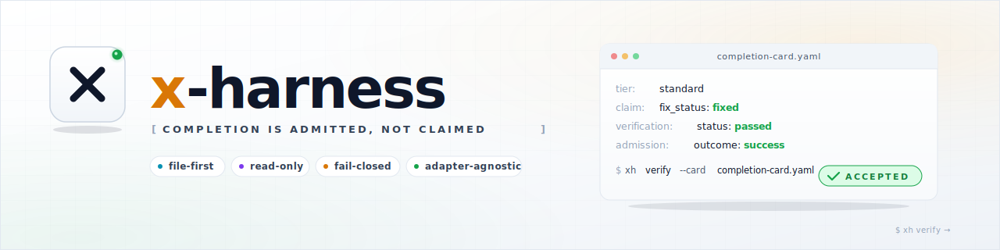

<picture>
  <source media="(prefers-color-scheme: dark)" srcset="assets/banner.svg">
  
</picture>

<br/>

# ⚡ x-harness

> **Completion is admitted, not claimed.**
> A lightweight, file-first verification harness for AI-agent workflows.

[](https://github.com/BrianNguyen29/x-harness/actions/workflows/x-harness-verify.yml)
[](https://github.com/BrianNguyen29/x-harness/actions/workflows/codeql.yml)
[](https://scorecard.dev/viewer/?uri=github.com/BrianNguyen29/x-harness)
[](LICENSE)
[](packages/cli/package.json)
[](go.mod)

[English](README.md) | [Tiếng Việt](README.vi.md)

> **New to x-harness?** Read [`docs/GETTING_STARTED.md`](docs/GETTING_STARTED.md) for a conceptual primer, then try the [Quickstart](#quick-start-5-minutes).

---

## What is x-harness?

`x-harness` is a small, opinionated **verification harness** for AI coding agents. It does **not** run your agents, replace your CI, or guarantee that code is correct. It does one bounded job:

> Turn an AI agent's "I'm done" claim into an **auditable admission decision** — `accepted` or `withheld` — against a repository policy.

It works **locally**, **offline**, and **file-first**. No daemon, no database, no server, no MCP service, no LLM calls, no network credentials. The source of truth is the files in your repository: schemas, policies, templates, and completion cards.

### How is it different from existing tools?

| Concern | Typical AI tooling | x-harness |
| :-- | :-- | :-- |
| Who decides "done"? | The agent itself | A **read-only verification gate** in this repo |
| Where does state live? | A remote server / SaaS | **Files** in your repository |
| Does it need a runtime? | Often a daemon, MCP, or cloud service | **No.** A single static binary |
| Is the decision auditable? | Hidden inside a model or dashboard | A **structured completion card** + JSONL trace |
| Is verification trusted? | Mixed with generation | **Decoupled.** `verify` never edits the work product |
| Can it fail closed? | Often "best effort" | **Yes.** Anything other than success is `withheld` |

In short: `x-harness` is **not** an agent runtime, an issue tracker, a planning system, an LLM gateway, or a deployment engine. It is a **policy gate** that decides whether an agent's claim of completion should be admitted.

---

## The core idea in 60 seconds

```text
   Agent writes code
        │
        ▼
   Agent writes a "completion card" (a small YAML file)
        │
        ▼
   xh verify --card completion-card.yaml
         │
         ▼
    Read-only verification gate evaluates the card
    against schemas + policies (no source mutation)
         │
         ▼
    ┌───────────────────────────────────────────┐
    │  acceptance_status: accepted   → exit 0  │   ✅ done
    │  acceptance_status: withheld   → exit 1  │   🚧 not done, with a recovery path
    └───────────────────────────────────────────┘
```

> `check` is an alias for `verify` — both run the same read-only gate.

The verifier is **read-only**. It inspects your card and evidence; it never edits your source to "fix" things while checking. The agent must produce a passing card itself.

---

## Beginner concepts (read this first)

| Term | What it means in x-harness |
| :-- | :-- |
| **Completion card** | A YAML file (e.g. `completion-card.yaml`) where an agent records what it claims to have done, with what evidence. |
| **Verify gate** | The `xh verify` command (alias `xh check`). It runs the read-only admission logic. |
| **Accepted** | Verification passed. Exit code `0`. The task is officially done. |
| **Withheld** | Any non-success outcome (`failed`, `blocked`, `skipped`, `timeout`, `error`). Exit code `1`. |
| **Tier** | One of `light`, `standard`, or `deep`. Determines how much evidence is required. |
| **PGV** | Pre-Gate Validation. **Advisory only.** It can suggest things, but it never grants admission. |
| **Adapter** | A small set of convention files (e.g. `CLAUDE.md`, `.cursor/rules/x-harness.mdc`) for a specific agent platform. |

---

## Install (from source checkout)

`x-harness` ships a **native Go CLI** (recommended) and a **TypeScript compatibility CLI** (source-checkout fallback only).

### Option A — Native Go CLI (recommended)

```bash
# Build a single static binary
go build ./cmd/x-harness

# Verify
./x-harness --version
```

> Requires **Go 1.22+**. The resulting `./x-harness` binary is self-contained.

### Option B — TypeScript compatibility CLI (source checkout)

Use this only when you want to run the parity baseline from source:

```bash
npm install
npm run build
node packages/cli/dist/index.js --version
```

> Requires **Node.js ≥ 20**. The published `x-harness` npm package is a Go-only wrapper; the Node fallback only works from a source checkout where `dist/` exists.

### Pre-built release binaries

Pre-built native binaries for `linux/amd64`, `linux/arm64`, `darwin/amd64`, `darwin/arm64`, `windows/amd64`, and `windows/arm64` are attached to each [GitHub release](https://github.com/BrianNguyen29/x-harness/releases). Download the binary that matches your platform, place it on your `PATH`, and rename it to `xh` (or `x-harness`).

### Package managers (Windows / macOS / Linux)

Scoop and Homebrew manifests are generated automatically at release time from [`packaging/`](packaging) and [`scripts/`](scripts). They will appear in their respective buckets once those buckets are published; until then, please use the pre-built binaries above or build from source.

---

## Quick start (5 minutes)

### Fast track

Run this in the project where you want to use x-harness:

```bash
xh init --minimal
xh doctor --root . --json
xh verify --card completion-card.yaml
```

Or try the repository fixtures first:

```bash
xh doctor --root . --json
xh verify --card examples/golden/regression/success-light/completion-card.yaml
```

### 1. Initialize a workspace

To start using `x-harness` in another project, run `init` at its root:

```bash
xh init --minimal        # default: contracts, templates, policies, schemas
# xh init --standard     # adds schemas and example solo-agent scenarios
# xh init --full         # adds multi-agent examples, adapters, and a GitHub Action
```

`init` stops with a blocked summary if it finds conflicting files; re-run with `--force` only when you intentionally want to overwrite them.

### 2. Health-check the workspace

```bash
./x-harness doctor
```

This validates that schemas, policies, templates, and adapter links are present and consistent. Look for `"healthy": true` in JSON output (`./x-harness doctor --json`).

### 3. Run verification

The repo ships with **28 golden scenario directories** across regression, capability, adversarial, conformance-strict, and recovery suites — **26 card-backed fixtures** plus **2 conformance-strict reference scenarios** (README-only, no completion card). Try a known-good one:

```bash
xh verify --card examples/golden/regression/success-light/completion-card.yaml
```

Expected output:

```yaml
outcome: success
acceptance_status: accepted
checks: 2 passed, 0 failed
```

Now try one that is missing required evidence:

```bash
xh verify --card examples/golden/regression/blocked-missing-evidence/completion-card.yaml
# exit code 1
```

Expected output:

```yaml
outcome: failed
acceptance_status: withheld
checks: 0 passed, 5 failed
```

The task is **withheld**, not silently marked as done. This is the *fail-closed* default.

---

## Daily core commands

Most users should start with this narrow loop. The full command matrix is in [`docs/CLI_COMMANDS.md`](docs/CLI_COMMANDS.md) and `xh --help-all`.

<!-- BEGIN X-HARNESS MANAGED CLI CORE COMMANDS -->
| Action | What it does |
| :-- | :-- |
| `init` | Install harness assets into a workspace |
| `doctor` | Validate workspace health and configuration |
| `verify` | Run read-only verification against a completion card |
| `check` | Alias for verify |
<!-- END X-HARNESS MANAGED CLI CORE COMMANDS -->

> **Terminal**: `xh <action>` (e.g. `xh check`)
> **Agent chat**: `/xh:<action>` (e.g. `/xh:check`) — see [`docs/ADAPTERS.md`](docs/ADAPTERS.md)

Use `handoff`, `recover`, `report`, `trace`, and `benchmark` when you need more workflow structure. Governance, federation, cost, evolution, attribution, and other experimental commands are intentionally kept out of the default onboarding path; see [`docs/CLI_COMMANDS.md`](docs/CLI_COMMANDS.md) for maturity labels.

### Boundary checks (`xh boundary`)

`xh boundary` runs deterministic, path-glob + import-regex checks against `policies/boundaries.yaml` (V1 scope; no AST, no semgrep, no LLM). Subcommands:

```bash
xh boundary lint                              # validate the policy file against the schema
xh boundary check --all                       # scan the whole repo
xh boundary check --changed                   # scan only files in `git diff --name-only`
xh boundary explain <file>                    # show which rules apply to a single file
```

When `policies/boundaries.yaml` is absent, `xh boundary check` exits 0 with a warning (opt-in feature). See [`docs/BOUNDARY.md`](docs/BOUNDARY.md) and [`schemas/boundary-policy.schema.json`](schemas/boundary-policy.schema.json) for the rule shape (`id`, `from`, `to_import`, `action`, `severity`, `intermediate?`, `allow?`, `applies_to_languages?`).

---

## Canonical handoff tiers

Task delegation uses **only** these three tiers. The labels `small`, `medium`, and `large` are not allowed in active runtime handoffs.

| Tier | Use when | Minimum evidence floor | Human approval |
| :-- | :-- | :-- | :-- |
| **`light`** | Narrow, low-ceremony work (1–3 files, near read-only). | `files_changed` + (`command_evidence` _or_ `manual_rationale`). | Optional |
| **`standard`** | Normal multi-step work, bounded synthesis. | `files_changed` + `command_evidence` + `done_checklist` + `prediction`. | Optional |
| **`deep`** | High-stakes work: architectural changes, migrations, multi-dependency. | Everything `standard` requires, **plus** `evidence_scope`, `untested_regions`, `remaining_risks`, `execution_controls`, `rollback_policy`, `verification_artifacts`, `state.read_set`, `state.write_set`. | Required |

See [`docs/ADMISSION_POLICY.md`](docs/ADMISSION_POLICY.md) for the full rules.

---

## How a verify run flows

```text
┌──────────────┐
│ Agent worker │  writes code + writes a completion card
└──────┬───────┘
       │
       ▼
┌──────────────┐
│ xh verify ...│  loads schema, loads policy, evaluates evidence floor
└──────┬───────┘
       │  read-only
       ▼
┌──────────────┐
│   Outcome    ├─── accepted   (exit 0)
│              ├─── withheld   (exit 1, with recovery routing)
└──────────────┘
```

Optional, opt-in verify stages (off by default):

- `xh verify --contract-oracles` — rule-based line-level assertions (`grep_rules`, `dependency_rules`).
- `xh verify --context-floor` — minimal file/ref presence checks.
- `xh verify --context-enforce off|advisory|block` — enforce context-manifest alignment.
- `xh verify --boundary-enforce off|advisory|block_high|block_all` — enforce boundary policy.
- `xh verify --decision-enforce off|advisory|block` — enforce decision-memory linkage.
- `xh verify --intent-enforce off|advisory|block` — enforce product-intent declaration.
- `xh verify --strict` — strict-schema mode for `withheld_reason` output.
- `xh verify --mutation-guard` — detect any verifier-side source mutation.

When verification fails, the engine emits a structured recovery object routing the work back to the right owner (e.g. `evidence_missing` → `implementation-worker`, `approval_missing` → `user`).

---

## Platform adapters

`x-harness` is **adapter-agnostic**. Pick the one that matches how you already work:

| Adapter | Use when | Key files |
| :-- | :-- | :-- |
| [Generic](adapters/generic) | You want plain Markdown conventions, no platform lock-in. | `AGENTS.md` |
| [Claude Code](adapters/claude-code) | You use Claude Code. | `CLAUDE.md`, worker / verifier agents, skills |
| [Cursor](adapters/cursor) | You use Cursor. | `.cursor/rules/x-harness.mdc` |
| [OpenCode](adapters/opencode) | You use OpenCode. | `verify-agent.md`, worker / verifier agents |
| [Antigravity](adapters/antigravity) | You use Antigravity. | rules + workflows under `rules/` and `workflows/` |
| [Codex](adapters/codex) | You use Codex. | `AGENTS.md` |

You only need **one**. Adapters are thin wrappers around the same CLI; they do not fork the contract.

---

## Documentation

| Document | What it covers |
| :-- | :-- |
| [`docs/GETTING_STARTED.md`](docs/GETTING_STARTED.md) | Conceptual primer: what x-harness solves and core ideas. |
| [`docs/QUICKSTART.md`](docs/QUICKSTART.md) | Step-by-step local setup and first verify. |
| [`docs/FAQ.md`](docs/FAQ.md) | Frequently asked questions (Go vs TS, LLM usage, etc.). |
| [`docs/ARCHITECTURE.md`](docs/ARCHITECTURE.md) | Layer model, validation cycle, design notes. |
| [`docs/VERIFY_GATE.md`](docs/VERIFY_GATE.md) | How the read-only verify gate works. |
| [`docs/ADMISSION_POLICY.md`](docs/ADMISSION_POLICY.md) | Fail-closed admission rules and evidence floors. |
| [`docs/SCHEMAS.md`](docs/SCHEMAS.md) | JSON schema inventory. |
| [`docs/RECOVERY.md`](docs/RECOVERY.md) | Recovery routing and playbook generation. |
| [`docs/ADAPTERS.md`](docs/ADAPTERS.md) | Full adapter guide and tier-selection reference. |
| [`docs/BOUNDARY.md`](docs/BOUNDARY.md) | Boundary policy lint, check, and verify integration. |
| [`docs/INTAKE.md`](docs/INTAKE.md) | Task intake tiering and readiness evaluation. |
| [`docs/DECISION.md`](docs/DECISION.md) | Decision-memory records (ADR-lite) and linkage. |
| [`docs/CONFORMANCE_STRICT_PROFILE.md`](docs/CONFORMANCE_STRICT_PROFILE.md) | Strict-profile rules and verification criteria. |
| [`docs/TYPESCRIPT_MAINTENANCE.md`](docs/TYPESCRIPT_MAINTENANCE.md) | Maintenance policy for the TypeScript fallback. |
| [`docs/CI.md`](docs/CI.md) | CI integration and dual-run gates. |
| [`docs/RELEASE_SECURITY.md`](docs/RELEASE_SECURITY.md) | Release signing, SBOM, and provenance. |
| [`docs/RELEASE_CANDIDATE.md`](docs/RELEASE_CANDIDATE.md) | Release-candidate checklist. |
| [`docs/THREAT_MODEL.md`](docs/THREAT_MODEL.md) | Trust boundaries, attacker capabilities, and non-goals. |
| [`docs/EVIDENCE_PROVENANCE.md`](docs/EVIDENCE_PROVENANCE.md) | Command evidence provenance, CI binding, checksums, and attestation guidance. |
| [`docs/CLI_COMMANDS.md`](docs/CLI_COMMANDS.md) | Generated command maturity matrix. |
| [`docs/PACKETS.md`](docs/PACKETS.md) | Immutable claim packets and chain integrity. |
| [`docs/REPORT_FORMATS.md`](docs/REPORT_FORMATS.md) | Report output formats (Markdown, JSON, HTML). |

The authoritative contract is [`X_HARNESS.md`](X_HARNESS.md).

---

## Examples at a glance

- **28 golden scenario directories** — 26 card-backed fixtures plus 2 conformance-strict reference scenarios (README-only) across regression, capability, adversarial, conformance-strict, and recovery suites under [`examples/golden/`](examples/golden/).
- **Real-world examples** — Next.js app and monorepo boundary setups under [`examples/real-world/`](examples/real-world/).

## Project status

- **Version**: `0.99.0-rc7` (release candidate). The CLI is feature-complete for the v0.x contract, but the project is **pre-1.0**. Pin your version and expect minor contract changes before `1.0`.
- **Native runtime**: Go CLI (recommended). The TypeScript CLI is a source-checkout compatibility baseline only and is no longer shipped in the published npm package.
- **No production claims**: A passing `xh verify` is **not** a guarantee of correctness. It means your card matches the policy. See [`docs/VERIFY_GATE.md`](docs/VERIFY_GATE.md) for what the gate does and does not check.

---

## Contributing

Contributions are welcome. Please read [`CONTRIBUTING.md`](CONTRIBUTING.md) first.

Harness-sensitive changes (admission policy, schemas, templates, CLI verify, adapters, skills) must include a completed [`templates/HARNESS_CHANGE_CONTRACT.md`](templates/HARNESS_CHANGE_CONTRACT.md) and pass `./x-harness doctor`, `./x-harness examples verify`, and `./x-harness benchmark --filter adversarial --gate` locally.

All contributors are expected to follow [`CODE_OF_CONDUCT.md`](CODE_OF_CONDUCT.md).

---

## Security

Please **do not** open public issues for suspected vulnerabilities. Use [GitHub private vulnerability reporting](https://github.com/BrianNguyen29/x-harness/security/advisories/new) or contact the maintainer privately. See [`SECURITY.md`](SECURITY.md) for the full disclosure process and supported versions.

---

## License

[MIT](LICENSE) — Copyright (c) 2026 Brian Nguyen.
