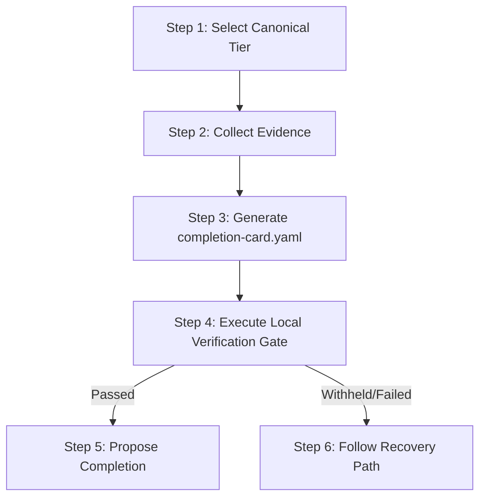

# Claude Code Handoff Skill: Task Completion & Verification

This skill guides the Claude Code agent through the structured task handoff process, ensuring absolute compliance with `x-harness` governance rules.

---

## 🧭 Handoff Workflow

When you are ready to conclude a task, you must execute the following systematic steps:



---

## 📋 Action Steps

### Step 1: Select the Canonical Handoff Tier

Review your task's complexity and impact to choose the narrowest tier that guarantees complete correctness.

> [!WARNING]
> You MUST ONLY use the canonical tier labels: `light`, `standard`, or `deep`.
> Do NOT use `small`, `medium`, or `large` as tier labels in active runtime handoffs or completion cards. Other fields may still use their own allowed values, such as `confidence: medium`.

- **`light` Tier**: Used for minor, superficial changes (e.g. styling, fixing typos, editing documentation). Requires basic summary claims.
- **`standard` Tier**: Used for standard features, logical changes, or normal bugfixes. Requires declaring file read/write sets, local unit test runs, and documenting any untested regions.
- **`deep` Tier**: Used for major structural code modifications, security-sensitive changes, or migrations. Requires independent read-only reviewer validation, cryptographic-grade evidence, and a comprehensive risk assessment.

### Step 2: Collect Evidence & Artifacts

Gather all execution details from your workspace:

1. **File sets**: Track all files you read and write during task execution.
2. **Local test runs**: Run the corresponding test suites and copy their exact terminal output commands.
3. **TypeScript checks**: Run typechecks (e.g. `npm run build` or `tsc`) to ensure no syntax/compilation issues exist.

### Step 3: Generate the completion-card.yaml

Create a standard `completion-card.yaml` at the root of the workspace or in your designated handoff directory following the `templates/COMPLETION_CARD.md` template.
Ensure the following blocks are populated matching the tier requirements:

- **claim**: Containing a brief summary of what changed and the fix status.
- **evidence**: Declaring file diffs and exact test commands run.
- **state**: Mapping absolute read and write sets.

### Step 4: Run the Local Verify Gate

Never propose completion without verifying your work product first! Run the local verification gate using `check`:

```bash
node packages/cli/dist/index.js check --card completion-card.yaml --strict
# or: node packages/cli/dist/index.js verify --card completion-card.yaml --strict
```

- **Outcome - Success**: If it outputs `outcome: success` with `acceptance_status: accepted`, proceed to Step 5.
- **Outcome - Withheld**: If the verify gate is withheld or fails, look at the returned validation errors, perform the necessary repairs, and re-run verification.

### Step 5: Propose Handoff & Completion

Construct a clean final response for the user, referencing the generated completion card and presenting your validation logs. Remember: _Agents may propose handoffs, but only the read-only verify gate can admit task completion!_

<!-- BEGIN X-HARNESS MANAGED CONTRACT: claude-handoff-skill-contract -->
<!-- generated-by: x-harness -->
<!-- contract-hash: ec6438371a039c93 -->

## Generated Adapter Contract

- Completion is admitted, not claimed.
- Verifier is read-only.
- Success is the only accepted outcome.
- Canonical tiers: light, standard, deep.
- PGV is advisory-only.

## Evidence Floor

- **light**: files_changed + (command_evidence or manual_rationale).
- **standard**: files_changed + command_evidence + done_checklist + prediction.
- **deep**: files_changed + command_evidence + evidence_scope_declared + untested_regions_declared + remaining_risks_declared + execution_controls_present + rollback_policy_present + done_checklist + prediction. Runtime-enforced: verification_artifacts, state.read_set, state.write_set.

## Strict Evidence Provenance

- verify --strict requires command_evidence entries to include command, exit_code, runner, and started_at for standard/deep cards.
- verify --strict requires verification_artifacts entries to include command, exit_code, runner, and started_at for standard/deep cards.

<!-- END X-HARNESS MANAGED CONTRACT: claude-handoff-skill-contract -->
