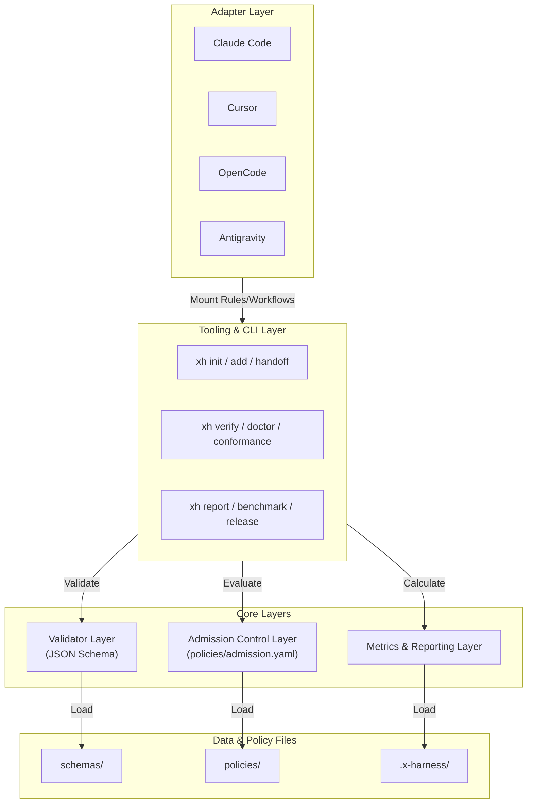

# Architectural Design

`x-harness` is built on a **file-first, CLI-assisted** architecture. It prioritizes local configuration files and deterministic verification logic over network daemons, background databases, or heavy agent runtime services.

---

## 🗺️ Architectural Layer Model

```txt
┌────────────────────────────────────────────────────────┐
│                    ADAPTER LAYER                       │
│    (Claude Code  /  Cursor  /  OpenCode  /  Antigravity)│
└──────────────────────────┬─────────────────────────────┘
                           │ 1. Mount Rules/Workflows
                           ▼
┌────────────────────────────────────────────────────────┐
│                   TOOLING & CLI LAYER                  │
│     (init, add, verify, handoff, doctor, conformance,  │
│      contract, release, examples, benchmark, report,   │
│      and other sub-commands — see `xh --help-all`)     │
└──────┬───────────────────┬─────────────────────────────┘
       │                   │
       │ 2a. Validate      │ 2b. Evaluate
       ▼                   ▼
┌──────────────┐   ┌──────────────┐   ┌──────────────────┐
│  VALIDATOR   │   │  ADMISSION   │   │     METRICS      │
│    LAYER     │   │ CONTROL LAYER│   │  REPORTING LAYER │
│ (JSON Schema)│   │(admission)   │   │  (reporting)     │
└──────┬───────┘   └──────┬───────┘   └────────┬─────────┘
       │                  │                    │
       │ Load             │ Load Policies      │ Calculate
       ▼                  ▼                    ▼
┌──────────────┐   ┌──────────────┐   ┌──────────────────┐
│ SCHEMAS FILE │   │ POLICIES FILE│   │   TRACING FILE   │
│   (schemas/) │   │  (policies/) │   │  (.x-harness/)   │
└──────────────┘   └──────────────┘   └──────────────────┘
```

---

## 🧜 Mermaid Architecture Diagram



---

## 🧱 Key Architectural Layers

### 1. Adapter Layer

Translates platform-specific conventions into unified `x-harness` parameters. It maps Cursor rules, Claude Code skills, and OpenCode workflows to standard input requirements without altering core execution behaviors.

### 2. Tooling & CLI Layer

Provides developer utilities to scaffold templates (`init`, `handoff`), modify files (`add`, `repair`), clear logs (`clean`, `reset`), run audits (`verify`, `doctor`, `conformance`), and emit reports (`report`, `benchmark`, `release`). The full command list is grouped by maturity and exposed via `xh --help-all` / `xh --help-maturity`. The native Go CLI is the canonical primary runtime. The TypeScript CLI remains a source-checkout compatibility baseline.

### 3. Validator Layer

Enforces complete structure verification on inputs via **JSON Schema** validation. This layer ensures that completion cards, sub-agent returns, and events comply with expected schemas prior to verification.

### 4. Admission Control Layer

Loads `policies/admission.yaml` and executes the core verification logic. It operates in a **strictly read-only** mode, ensuring the verification process does not mutate the directory files to fix logical or lint failures during checking.

> **Note:** Contract Oracle (`verify --contract-oracles`) and Context Floor (`verify --context-floor`) are **optional** verify stages. Both default to off and must be explicitly enabled. Contract Oracle performs line-level grep/dependency rule checks. Context Floor performs minimal file/ref presence checks.

### 4a. Boundary checks (`xh boundary`)

`xh boundary` is a verify-adjacent, deterministic policy checker. It loads `policies/boundaries.yaml` (schema: `schemas/boundary-policy.schema.json`) and matches each candidate file's path-glob (`from`) against the rule's import pattern (`to_import`) using simple regex (V1 — no AST, no semgrep, no LLM). Subcommands are `lint`, `check --all|--changed`, and `explain <file>`. Boundary checks are opt-in: when the policy file is missing, `xh boundary check` exits 0 with a warning instead of failing.

### 4b. Enforce stages in verify

The verify gate supports opt-in enforce flags that turn advisory checks into blocking predicates:

- `--boundary-enforce off|advisory|block_high|block_all` — boundary policy enforcement
- `--decision-enforce off|advisory|block` — decision record linkage validation
- `--intent-enforce off|advisory|block` — permission-intent classification enforcement
- `--context-enforce off|advisory|block` — context manifest freshness enforcement

All enforce flags default to `off` and must be explicitly enabled.

### 5. Metrics & Reporting Layer

Computes deterministic, local-first performance metrics analyzing verification strength, state consistency, recovery ability, replayability, and execution costs without relying on external SaaS APIs or monitoring dashboards.

---

## 🔄 Core Validation Handoff Cycle

The interaction sequence for a standard verification run:

```txt
[Developer / Agent]
       │
       │ 1. Run CLI command: "./x-harness verify --card completion-card.yaml"
       ▼
[CLI / Go binary or TypeScript compatibility entrypoint]
       │
       │ 2. Load schemas (schemas/completion-card.schema.json)
       ▼
[Schema validators]
       │
       ├─► [FAIL] ──► Exits with Status 1 (Schema Validation Error)
       │
       └─► [PASS] ──► Loads Admission Rules (policies/admission.yaml)
                      │
                      ▼
              [Admission core]
                      │
                      ├─► [FAIL] ──► Suggested recovery route ──► Exit Status 1
                      │
                      └─► [PASS] ──► Output success ───────────► Exit Status 0
```
