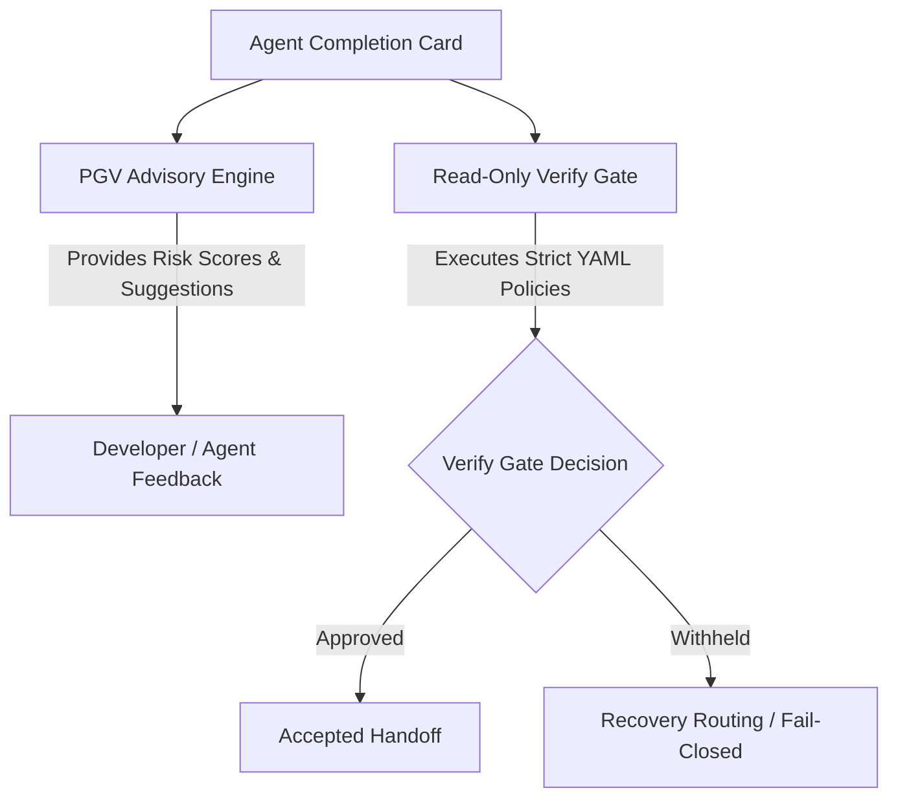

# Pre-Gate Validation (PGV) Advisory Policy

This document defines the roles, limitations, and operational boundaries of the Pre-Gate Validation (PGV) module in `x-harness`.

---

## ⚖️ The Advisory-Only Mandate

The fundamental rule of task governance in `x-harness` is the **read-only verification gate**. To maintain absolute audit integrity, PGV is strictly advisory-only.

> [!IMPORTANT]
> PGV advice is advisory-only. It never overrides verify, never grants admission authority, and never silently blocks execution. Completion is admitted *only* when the read-only verify gate passes.

| Action / Capability | 🤖 Pre-Gate Validation (PGV) | 🛡️ Read-Only Verify Gate |
| :--- | :---: | :---: |
| **Admission Decision** | ❌ Forbidden (Advisory only) |  **Authoritative Gate** |
| **Silent Blocking** | ❌ Forbidden | ❌ Forbidden (Always outputs reasons) |
| **Risk Scoring & Prediction** |  **Allowed** (Predictive scores) | ❌ N/A (Deterministic pass/fail) |
| **Violation & Contradiction Detection**|  **Allowed** (Static analysis) |  **Allowed** (Deterministic checks) |
| **Escalation Suggestion** |  **Allowed** (Interactive recommendations)| ❌ N/A (Policy-defined outputs) |

---

## 🔍 Core PGV Capabilities

PGV operates as an early-warning static analyzer and advisor, scanning completion cards and workplace traces to provide preemptive intelligence before a final handoff is triggered:

### 1. Risk Scoring & Predictive Analysis
PGV analyzes metadata changes, complexity flags, and task ownership structures to assign a predictive risk score.
*   **Low Risk**: Complete file mapping, passing local tests, and consistent signatures.
*   **High Risk**: Mismatched file sets, lack of confidence metrics, or complex code mutation without declared testing evidence.

### 2. Contradiction & Inconsistency Spotting
Before sending the card to the verify gate, PGV identifies contradictions that would trigger a fail-closed response, such as:
*   Declaring a file in the `write_set` that is missing from the actual git diff.
*   Indicating a status of `fixed` while leaving `handoff.next_action` set to a rollback script.

### 3. Suggested Control Actions & Escalation
If a task touches critical system paths (defined in policy files), PGV advises standardizing or deepening the tier (e.g., suggesting an escalation from `standard` to `deep` tier templates).

---

## 🧱 Architectural Boundaries

The separation of concerns between PGV and the Verify Gate ensures that even if PGV tools are modified or compromised, the core verification gate remains robust and uncompromised:

### Safety Policy Checklist
1. **No Autonomy**: PGV cannot execute `git commit` or alter codebase files.
2. **No Secret Suppression**: Any warnings or advisories generated by PGV must be printed transparently in standard outputs.
3. **Fail-Closed Verification**: The Verify Gate treats all incomplete or missing PGV schemas as withheld by default.
