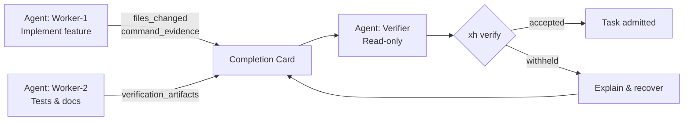

# Multi-Agent Workflow

This tutorial walks through a collaborative task where multiple agents contribute to the same completion card and the verify gate decides whether the combined claim is admitted.

> Every behavior described here is supported by the current Go CLI and TypeScript compatibility baseline. Nothing is aspirational.

---

## Why multi-agent?

A single agent may implement code while another writes tests, a third reviews documentation, and a fourth acts as the read-only verifier. x-harness does not orchestrate agents; it provides a **single, auditable completion card** that consolidates evidence from all contributors and a **read-only verify gate** that decides whether the task is accepted.

## Authoritative artifact hierarchy

In any multi-agent or long-running session, precedence is strict:

1. **Source files and git diff** are authoritative for implementation state.
2. **The completion card** is authoritative for the completion claim.
3. **Policies** (`policies/admission.yaml`) are authoritative for admission rules.
4. **Verify output** is authoritative for the accepted/withheld mapping.
5. **Chat summaries** are non-authoritative.

> If chat says "done" but the card says withheld, the card wins. If the card claims accepted but verify output disagrees, verify output wins.

## Typical flow



---

## Step-by-step walkthrough

### 1. Agree on tier and scope upfront

All contributors must align on the task tier (`light`, `standard`, or `deep`) because the evidence floor determines what fields are required. See [ADMISSION_POLICY.md](../ADMISSION_POLICY.md) for the exact floor per tier.

### 2. Workers produce evidence

Each worker appends its evidence to the shared completion card. At minimum:

- **Files changed** (`evidence.files_changed`) — every source file touched.
- **Command evidence** (`evidence.command_evidence[]`) — commands run with `runner`, `exit_code`, and `started_at`.
- For **standard** and **deep**, also include `done_checklist` and `prediction`.

### 3. Consolidate the card

One agent (or an orchestrator) merges the pieces into a single YAML file that satisfies the schema and the evidence floor. A minimal multi-agent standard card includes:

```yaml
schema_version: "x-harness.completion-card.v1"
task_id: "multi-agent-refactor"
tier: standard
owner: "worker-1"
accountable: "team-lead"
claim:
  fix_status: fixed
  summary: "Refactor auth module and add tests"
  evidence:
    - files_changed: ["src/auth.go", "src/auth_test.go"]
      command_evidence:
        - command: "go test ./src/..."
          exit_code: 0
          runner: "worker-2"
          started_at: "2026-06-26T10:00:00Z"
verification:
  status: passed
  checks: []
admission:
  outcome: success
acceptance_status: accepted
handoff:
  next_action: done
  owner: verifier
```

> The schema requires `owner`, `accountable`, `handoff.next_action`, and `handoff.owner` on every card. Use the actual agent identifiers for your team.

### 4. Verifier runs the gate

The verifier is read-only. It must not edit source files or patch the card while verifying.

```bash
xh verify --card completion-card.yaml
```

If the output is `accepted`, the task is admitted. If it is `withheld`, move to step 5.

### 5. Explain and recover

Use `xh explain` to surface the blocking predicate:

```bash
xh explain --card completion-card.yaml
# -> blocking_predicates: [evidence_floor_missing]
```

Then use `xh recover` to preview a conservative patch that fills the missing handoff or evidence fields without overwriting user scalars:

```bash
xh recover --patch-card completion-card.yaml --evidence src/auth.go
# preview only
xh recover --patch-card completion-card.yaml --confirm --evidence src/auth.go
# apply and create a backup
```

After patching, re-run `xh verify` until the outcome is `accepted`.

### 6. Run the regression gate

Sanity-check the bundled regression suite to confirm the multi-agent example still passes:

```bash
xh examples verify --suite=regression --json
```

---

## Real-world examples in this repo

- `examples/03-multi-agent/` — A standard worker/verifier split.
- `examples/golden/capability/multi-agent-success/` — A golden standard-tier card with three collaborating agents.

## Next docs

- [Deep & Governed Verification](deep-governed-verification.md) — When the task tier is `deep` or you need strict enforce flags.
- [Verify Gate](../VERIFY_GATE.md) — Full admission policy details.
- [Admission Policy](../ADMISSION_POLICY.md) — Evidence floor and rejection conditions.
- [Runtime Contract](../RUNTIME_CONTRACT.md) — Artifact hierarchy and adapter rules.
